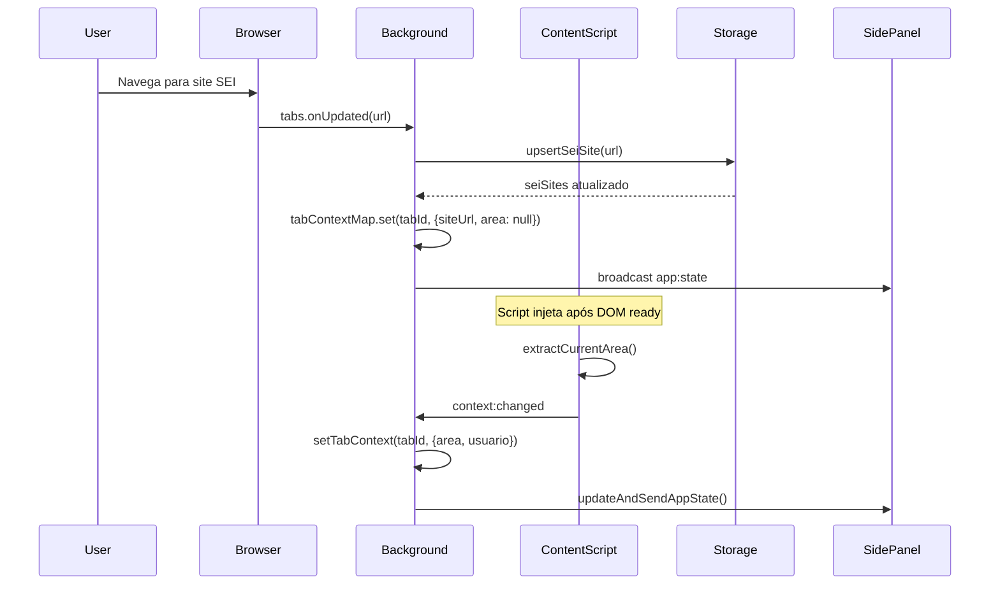
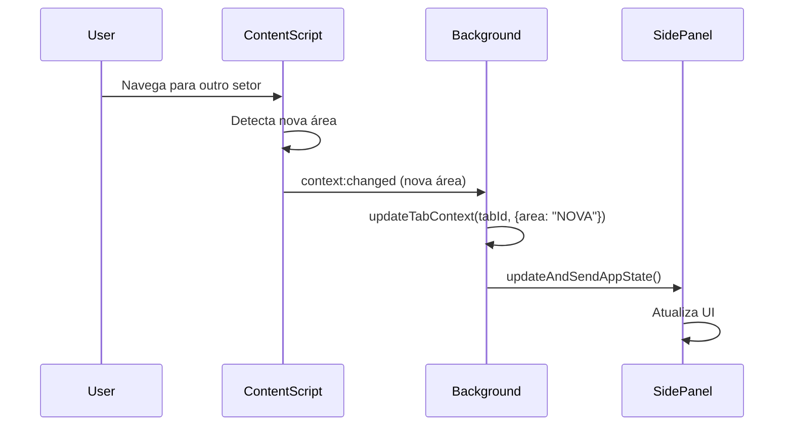
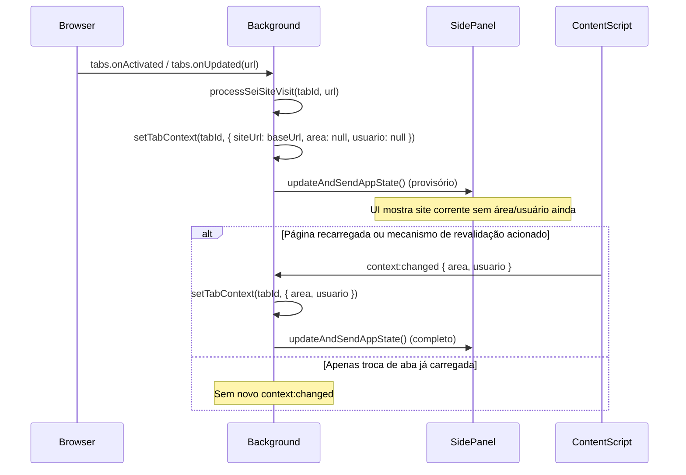
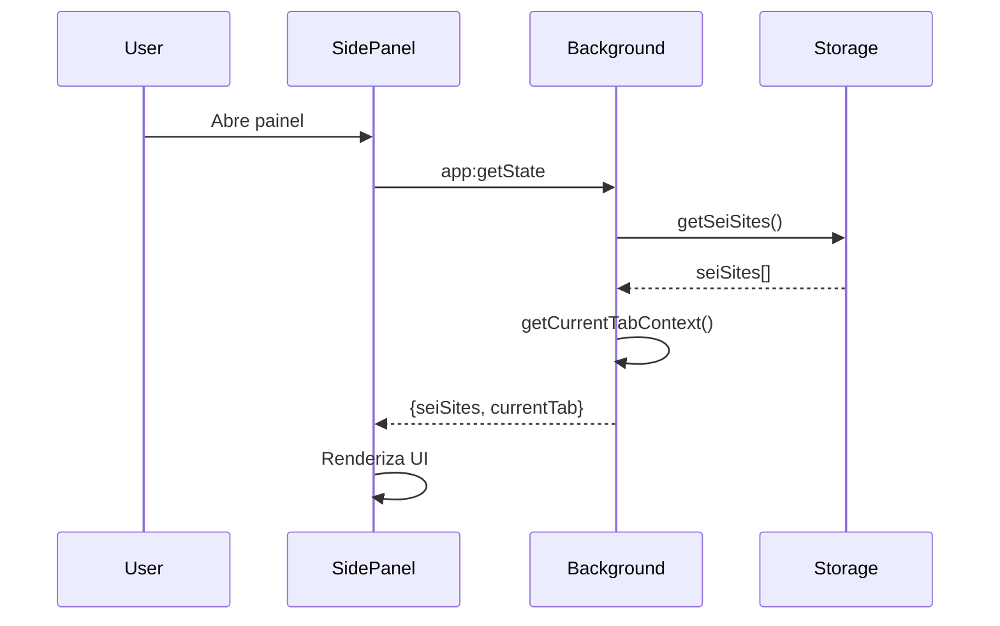

# Estado da Aplicação (AppState)

## O que é o AppState?

`AppState` é a estrutura de dados centralizada que representa o **estado global da extensão** em um determinado momento. Ele é usado para sincronizar informações entre os diferentes componentes da extensão (background, side panel, etc.).

```typescript
type AppState = {
  seiSites: SeiSite[];      // Lista de todos os sites SEI detectados (persistente)
  currentTab?: TabContext;  // Contexto completo da aba ativa (efêmero)
}
```

## Componentes do AppState

### 1. `seiSites` (Persistente)
- **Fonte**: `chrome.storage.local` via `getSeiSites()`
- **Conteúdo**: Array de sites SEI detectados com metadados
- **Persistência**: Sobrevive a reinicializações do navegador
- **Exemplo**:
  ```json
  [
    {
      "url": "https://sei.cjf.jus.br",
      "name": "Conselho da Justiça Federal",
      "firstDetectedAt": "2025-11-11T10:00:00.000Z",
      "lastVisitedAt": "2025-11-11T15:30:00.000Z"
    }
  ]
  ```

### 2. `currentTab` (Efêmero)
- **Fonte**: Map em memória via `getCurrentTabContext()`
- **Conteúdo**: Contexto da aba ativa no momento (URL, área, usuário, etc.)
- **Persistência**: Apenas na sessão; reconstruído quando content script detecta dados
- **Exemplo**:
  ```json
  {
    "siteUrl": "https://sei.cjf.jus.br",
    "area": "SESINF",
    "usuario": "João Silva",
    "lastUpdatedAt": "2025-11-11T15:30:45.123Z"
  }
  ```

---

## Quem Acessa o AppState?

### 1. **Side Panel** (src/sidepanel/)
- **Como**: Através do hook `useAppState()`
- **Quando**: 
  - Ao abrir o painel (solicita via `app:getState`)
  - Continuamente (escuta mensagens `app:state`)
- **Para quê**: Renderizar UI com lista de sites e contexto atual

```typescript
// src/sidepanel/hooks/useAppState.ts
const [state, setState] = useState<AppState>({ seiSites: [] });

useEffect(() => {
  // Solicita estado inicial
  chrome.runtime.sendMessage({ type: 'app:getState' }, (response) => {
    setState(response);
  });
  
  // Escuta atualizações
  chrome.runtime.onMessage.addListener((msg) => {
    if (msg.type === 'app:state') {
      setState(msg.state);
    }
  });
}, []);
```

### 2. **Background Service Worker** (src/background/)
- **Como**: Constrói o AppState dinamicamente a partir de:
  - `getSeiSites()` → storage persistente
  - `getCurrentTabContext()` → Map em memória
- **Quando**: 
  - Ao receber `app:getState` (retorna snapshot atual)
  - Antes de fazer broadcast via `updateAndSendAppState()`
- **Para quê**: Responder consultas e notificar mudanças

```typescript
// src/background/index.ts
async function handleGetState(sendResponse) {
  const seiSites = await getSeiSites();
  const currentTab = await getCurrentTabContext();
  sendResponse({ seiSites, currentTab });
}

// src/background/services/panelService.ts
export async function updateAndSendAppState() {
  const seiSites = await getSeiSites();
  const currentTab = await getCurrentTabContext();
  const state: AppState = { seiSites, currentTab };
  chrome.runtime.sendMessage({ type: 'app:state', state });
}
```

---

## Quem Modifica o AppState?

O AppState **não é modificado diretamente**. Ele é **reconstruído** a partir de fontes autoritativas:

### 1. **Modificação de `seiSites`** (Persistente)

#### Quem modifica:
- **Background Service Worker** via `upsertSeiSite()`

#### Quando:
- Navegação para site SEI detectada (`tabs.onUpdated`, `tabs.onActivated`)
- Content script envia `context:changed`

#### Como:
```typescript
// src/background/services/panelService.ts
export async function processSeiSiteVisit(tabId: number, url: string) {
  await upsertSeiSite(url);  // ✅ Modifica storage persistente
  // ... configura side panel, badge, etc.
}
```

#### Fluxo:
```
1. Usuário navega → tabs.onUpdated dispara
2. Background detecta URL SEI
3. upsertSeiSite(url) → grava em chrome.storage.local
4. Lista seiSites é atualizada
```

---

### 2. **Modificação de `currentTab`** (Efêmero)

#### Quem modifica:
- **Content Script** (detecta) → **Background** (armazena)

#### Quando:
- Content script detecta área/setor do DOM
- Envia mensagem `context:changed`
- Background armazena no Map em memória

#### Como:
```typescript
// src/content/index.ts (detecta)
const area = extractCurrentArea();
const usuario = extractCurrentUser();
chrome.runtime.sendMessage({
  type: 'context:changed',
  siteUrl: baseUrl,
  area: area,
  usuario: usuario
});

// src/background/index.ts (armazena)
async function handleContextChanged(msg, sender) {
  const tabId = sender.tab.id;
  setTabContext(tabId, {     // ✅ Modifica Map em memória
    siteUrl: msg.siteUrl,
    area: msg.area,
    usuario: msg.usuario
  });
  await updateAndSendAppState();  // Notifica mudança
}
```

#### Fluxo:
```
1. Content script executa no DOM da página SEI
2. Extrai área do HTML (ex: "SESINF") e usuário (ex: "Ricardo Bernardes dos Santos")
3. Envia context:changed → Background
4. Background: setTabContext(tabId, {siteUrl, area, usuario})
5. Map em memória é atualizado
6. Background: updateAndSendAppState() → notifica Side Panel
```

---

## Ciclo de Vida Completo

### Detecção Inicial (Primeira Visita)



### Atualização de Contexto (Navegação Interna)



### Troca de Aba (onActivated / onUpdated)

Quando o usuário troca de aba ou a URL muda, o background envia um "contexto provisório". IMPORTANTE: Apenas trocar de aba NÃO dispara automaticamente um novo `context:changed` — esse evento só ocorre quando o content script executa (primeiro carregamento da página) ou quando algum mecanismo explícito de revalidação é implementado.

Hoje: na troca de aba já carregada, o content script não reenviará `context:changed` (ele já rodou antes). Por isso área/usuário exibidos são os últimos valores armazenados em memória. Se nunca houve detecção naquela aba (ex.: aba aberta antes da instalação), ficará área/usuário `null` até uma navegação ou recarregamento.



### Consulta de Estado (Side Panel Abre)



---

## Fontes de Verdade

| Dado | Fonte Autoritativa | Persistência | Modificado Por |
|------|-------------------|--------------|----------------|
| `seiSites` | `chrome.storage.local` | Persistente | `upsertSeiSite()` no background |
| `currentTab.siteUrl` | Map em memória | Sessão | `setTabContext()` após detecção de navegação |
| `currentTab.area` | Map em memória | Sessão | `setTabContext()` após `context:changed` |
| `currentTab.usuario` | Map em memória | Sessão | `setTabContext()` após `context:changed` |

---

## Garantias e Invariantes

### ✅ O que é garantido:
- `seiSites` sempre reflete o histórico completo de sites visitados
- `currentTab` é `undefined` quando não há aba ativa ou aba não é SEI
- `updateAndSendAppState()` sempre busca estado mais recente antes de enviar
- Broadcasts são enviados sempre que há mudança de contexto relevante
- Storage persistente sobrevive a hibernação do service worker
- Em troca de aba, um broadcast provisório garante `currentTab.siteUrl` imediato; `area` e `usuario` podem estar `null` até `context:changed`

### ⚠️ O que NÃO é garantido:
- `currentTab.area` pode ser `null` temporariamente até content script detectar
- Map em memória é perdido se service worker hibernar (será reconstruído)
- Broadcasts podem não chegar se side panel não estiver aberto (mensagem ignorada)

---

## Notas de UI / Heurística

O painel considera a aba atual como site SEI se:
1. `isSeiUrl(currentTab.siteUrl)` retorna `true`; OU
2. A `currentTab.siteUrl` está presente em `seiSites` (URL base normalizada já detectada).

Esse fallback evita falso negativo para URLs base como `https://sei.cjf.jus.br` que podem não conter `/sei/` no path naquele momento. Assim, o banner é exibido logo após a troca de aba e enriquecido quando chegam `area` e `usuario`.

### Revalidação em Troca de Aba (Opcional)

Se for necessário garantir atualização de área/usuário ao simplesmente ativar uma aba (sem navegar/recarregar), pode-se implementar um dos mecanismos abaixo:

1. Background envia mensagem `context:request` na `tabs.onActivated`; content script escuta e responde enviando `context:changed` novamente.
2. Content script adiciona `document.addEventListener('visibilitychange', ...)` e reenviaria `context:changed` quando `document.visibilityState === 'visible'`.
3. Background usa `chrome.scripting.executeScript` para invocar função de detecção diretamente na aba ativa.

Trade-offs:
- (1) Simples e explícito; exige novo tipo de mensagem.
- (2) Pode gerar eventos redundantes se o usuário alternar rápido; adicionar debounce.
- (3) Mais intrusivo; evita manter listener extra no content script.

Estado atual: Nenhum desses mecanismos está ativo; apenas navegação/reload gera novo `context:changed`.

---

## Debugging

### Ver estado atual no console:

```javascript
// No background (DevTools do service worker):
chrome.storage.local.get('seiSites', console.log);

// Simular consulta de estado:
chrome.runtime.sendMessage({type: 'app:getState'}, console.log);

// Ver Map em memória (adicionar breakpoint em src/background/index.ts):
console.log(Array.from(tabContextMap.entries()));
```

### Logs relevantes:

```
[Painel SEI] handleTabChangeOrNavigation {tabId: 123, url: "...", isSei: true}
[Painel SEI] context:changed {tabId: 123, siteUrl: "...", area: "SESINF", usuario: null}
[Painel SEI][broadcast] sending app:state {seiSites: [...], currentTab: {...}}
```

### Acessar currentTab no Side Panel:

```typescript
// src/sidepanel/App.tsx
const { seiSites, currentTab } = useAppState();

// Uso:
{currentTab?.siteUrl}     // URL do site
{currentTab?.area}        // Área/setor
{currentTab?.usuario}     // Usuário (quando implementado)
{currentTab?.lastUpdatedAt}
```

---

## Resumo

| Aspecto | Detalhes |
|---------|----------|
| **O que é** | Estrutura de dados que representa estado global da extensão |
| **Estrutura** | `{ seiSites: SeiSite[], currentTab?: TabContext }` |
| **Quem lê** | Side Panel (via `useAppState`), Background (para construir broadcasts) |
| **Quem escreve** | Background escreve nas fontes (`storage.local` + `tabContextMap`) |
| **Quem detecta mudanças** | Content Script detecta → Background processa → Side Panel renderiza |
| **Persistência** | `seiSites` persistente; `currentTab` efêmero (reconstruído por sessão) |
| **Sincronização** | Via `app:state` (push) e `app:getState` (pull) |
| **Broadcast** | `updateAndSendAppState()` busca estado atual e envia automaticamente |
